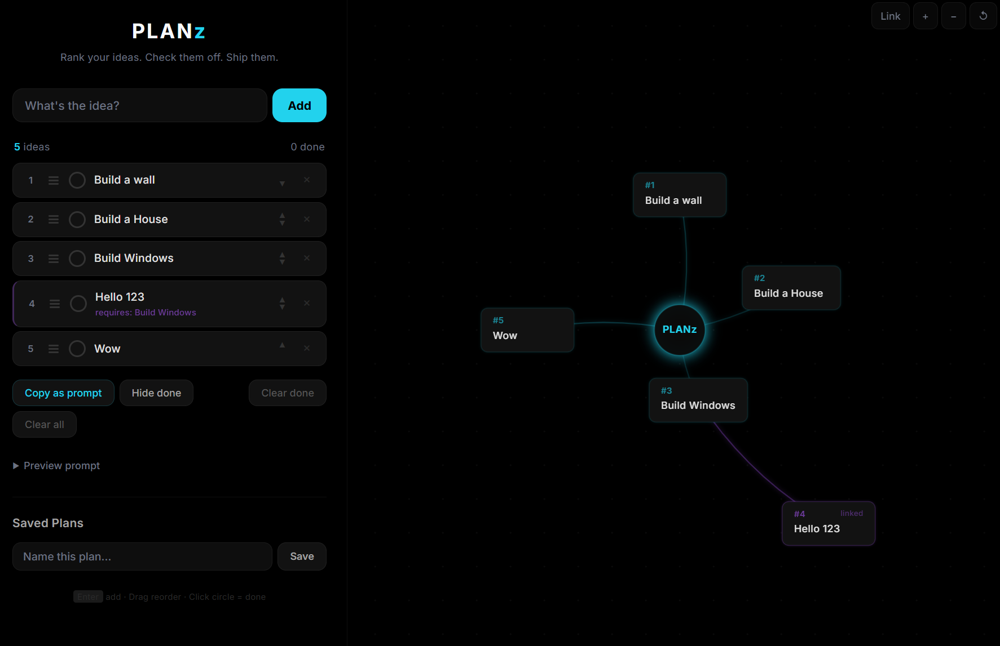

<div align="center">

# PLANz

**Rank your ideas. Connect them. Ship them.**

A visual mind map that turns your ideas into ranked plans you can actually use.

<br>



<br>

</div>

---

Split-pane desktop app. Left side is a ranked list of ideas with drag-and-drop reordering and checkboxes. Right side is a live mind map canvas where every idea becomes a node connected to a central hub. Add an idea on the left, it shows up on the map instantly.


<sub>Photo by <a href="https://unsplash.com/@alvannee">Alvaro Reyes</a> on Unsplash</sub>

The main thing PLANz does differently from other mind maps is that it's built around _output_. You're not just organizing thoughts visually -- you're building a ranked, actionable plan that you can export as a numbered prompt or checklist with one click. Connect ideas to show dependencies, check them off as you go, and save the whole thing as a named plan you can reload later.

Everything is stored in localStorage. No accounts, no cloud, no database. The app runs as a standalone binary via Tauri, or straight from the HTML file in a browser. Drop it on a USB stick and it works wherever you plug it in.

## What you can do

Add ideas and drag them into priority order. Each idea gets a rank number. Click the circle to mark it done. Connect ideas to each other using link mode -- click "Link" in the top right, click a parent node, then click a child. Purple lines show the dependency. Connected ideas show "requires: parent name" in the list view.

"Copy as prompt" formats your entire plan as a clean numbered list with dependencies noted, ready to paste into an AI chat, a doc, or anywhere else. There's also a live preview panel that updates as you work.

Save plans by name and load them back whenever. Each saved plan remembers every idea, its rank, connections, and done state.

On the canvas, scroll to zoom, drag the background to pan, drag individual nodes to rearrange the layout. Nodes you've moved stay where you put them. Reset view snaps everything back.

## Portable

PLANz stores everything in the browser's localStorage. The built binary is a single exe with no installer required. You can put it on a flash drive, external disk, or shared folder and run it directly. No installation, no config files, no setup.

The app also works as a plain HTML file -- open `src/index.html` in any browser and you have the full app without building anything.

## Building

You need Node.js, Rust, and the [Tauri 2 prerequisites](https://v2.tauri.app/start/prerequisites/).

```
npm install
npm run build
```

Installer and binary end up in `src-tauri/target/release/bundle/`.

For development with hot reload:

```
npm run dev
```

## Stack

Single HTML file frontend (vanilla JS, no framework, no build step). Canvas API for the mind map rendering. Tauri 2 wraps it as a desktop app. The Rust backend is minimal -- just the Tauri shell, no custom commands. All logic lives in the browser.

## License

MIT
